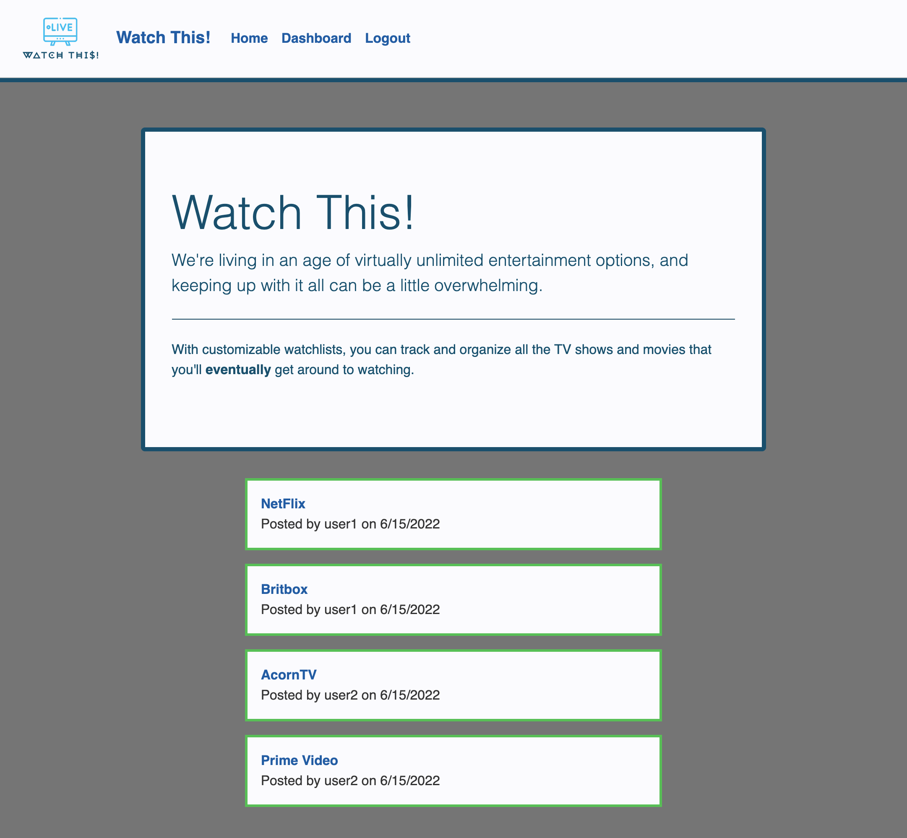

# Watch This!

We're living in an age of virtually unlimited entertainment options, and keeping up with it all can be a little overwhelming. Using the Watch This! App you can create customizable watchlists that allow you to track and organize all the TV shows and movies that you'll eventually get around to watching.

# Table of Contents

- [Usage](#usage)
- [License](#license)
- [Contribute](#contribute)
- [Questions](#questions)
- [Github Profile](#github)
- [Deployed App](#deployed-app-on-heroku)

## Usage

After logging in or creating a new user you can create watchlists. If you edit those watchlists you can add shows and reviews. The main page will show watchlists from all users. The dashboard will show only the logged in user's shows

## License

This software is under the [MIT](./LICENSE) license.

## Contribute

Refer to [Contributor Covenant](https://www.contributor-covenant.org/) for contribution guidelines.

## Questions

For questions or to report issues contact authors at:

- bagley@umn.edu
- ecarlson0123@yahoo.com
- oscarhurtadosb@gmail.com
- markofprogress@gmail.com

## GitHub

https://github.com/bagl0025/watch-this

## Deployed app on Heroku

https://gentle-headland-06018.herokuapp.com/
